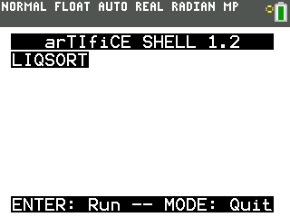

### Liquid Sort CE!
In this game (for the TI-84 Plus CE calculator) you take different liquids from glasses, and move them until you are able to get all the glasses sorted with the correct liquids!

## Instructions:
Use the left and right arrow keys to change which glass to select, then press "2nd" to select a glass, and press "2nd" again on another glass to pour the liquid your selected glass into the other glass you just clicked.

To compile the program, download the [CE Toolchain](https://github.com/CE-Programming/toolchain/releases) and the libraries with it [(clibs)](https://github.com/CE-Programming/toolchain/releases/download/nightly/clibs.8xg), open up the CEdev batch program (or terminal on mac/linux), go over to this folder, and then type in "make". It should create a TI-84 plus CE executable in the "bin folder".

## Adding levels and customization:
This is a bit of an advanced tutorial if you don't know coding, but stick with me. In order to make a custom bottle level, go to the file "levels.h" and change "num_bottle_levels" to the amount of numbers you want, then go into the levels.c file, and then add another 2d array in this format:

{{-1,-1,-1,-1},
{-1,-1,-1,-1},
{-1,-1,-1,-1},
{-1,-1,-1,-1},
{-1,-1,-1,-1},
{-1,-1,-1,-1},
{-1,-1,-1,-1},
{-1,-1,-1,-1}},

The negative ones are used to represent no bottle, meaning that if the bottle were all negative ones, it would not show up on the screen. You can change these numbers however you would like, with -1 being no bottle, 0 being empty space, and 1-6 being various colours. The starting numbers are from the top, so for example the set {0,0,1,2} is empty, empty, red, green.

